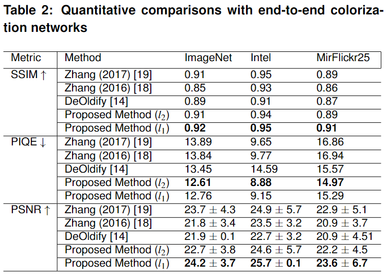

# ImageColorNet: An end-to-end Perception-consistent Automatic Colorization - *Tanmay Ambadkar, Jignesh S. Bhatt*

## Abstract

*Colorization of grayscale images is an ill-posed problem. In this letter, we present ImageColorNet, a novel 70-layer end-to-end deep convolutional residual network for automatic colorization in CIELAB color space. The idea is to make the problem better-posed without any reference or user input while producing truly automatic colorization closer to human visual perception. First, given grayscale image (L) is passed through larger-sized convolutional filters for learning gross parameters for colorization. They are then sequentially fed into a set of sixteen residual convolutional blocks that incorporate semantic learning and enable stable training. Further updated parameters are processed for inserting finer details using smaller-sized convolutional filters and then consolidated by summing up with the learnt gross parameters. Channels are then gradually reduced to two yielding the AB channels. The estimated A and B channels are combined with the input L channel facilitating a better colorized image. Since the learned colorization function in the AB space is parameterized by gross, finer, and stable color semantics; it better handles the colorization of multiple objects, edge bleed, and underlying semantics. Proposed ImageColorNet is analysed and comparative experiments with end-to-end neural networks are conducted on different datasets.*

## Model Architecture

## Some results and comparisons with other state-of-art

The following are some results on different kinds of images, including a few print and scan images.

The next image shows a comparison with the current state of art. 

The following table shows a quantitative comparison with the state-of-art. 

